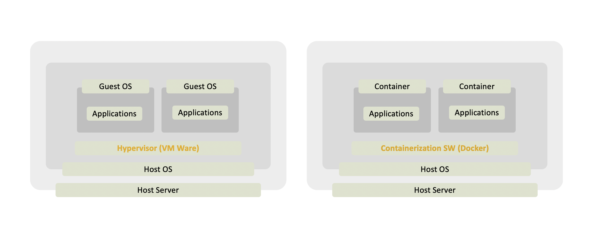

# Kubernates
대규모 서비스 지원 환경에서 효율적인 자원 이용을 위해 auto-scaling, auto-healing, auto-deployment 를 지원하는 오픈소스  

## VM vs Container  

서비스를 운영하는데 필요한 라이브러리나 시스템 환경 등을 `이미지`화 시켜 이를 컨테이너라 부르고  
Docker 와 같은 컨테이너 서비스가 제공되는 환경에서 구동시키면  
새로운 Host 환경에 구애받지 않고 서비스를 구축할 수 있다는 장점이 있다  
또한 OS 에서 제공하는 커널 및 CPU 와 같은 자원들이 컨테이너 단위로 분리되어 이용될 수 있게끔 도와준다  

Kubernates 는 이런 컨테이너의 장점을 활용하여  
논리적으로 그룹화가 필요한 컨테이너들을 묶어 이 그룹을 `Pod` 라고 부르며 `배포의 단위`로 삼는다      

## Tutorials

### [1. Build Docker images](docs/docker/docker.md)