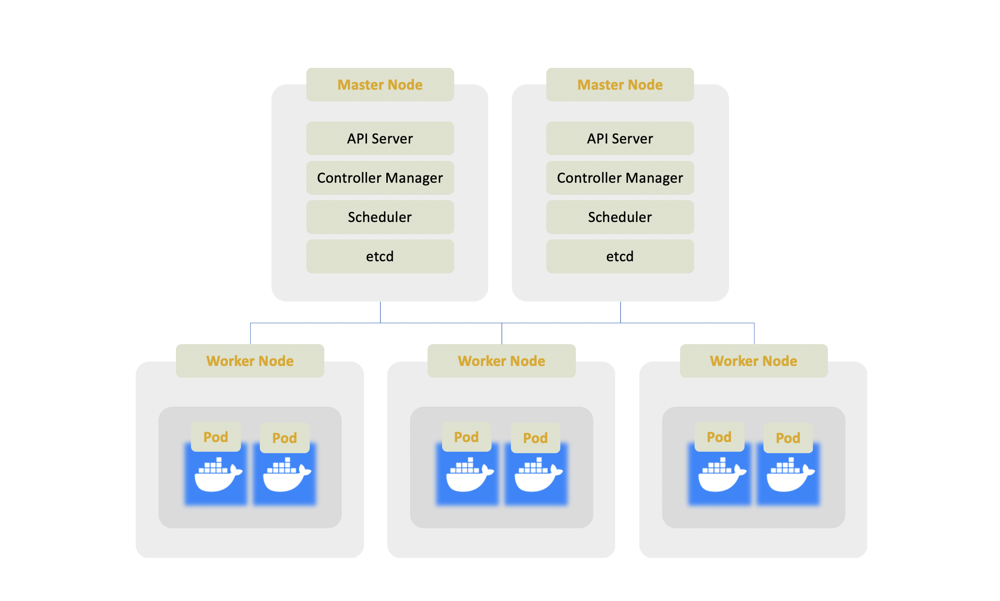

# Kubernetes
대규모 서비스 지원 환경에서 효율적인 자원 이용을 위한 `Container Orchestration OpenSource` 이며 다음과 같은 장점이 있다      
    
- Scalability, high performance  
- High Availability, no downtime  
- Disaster Recovery, backup and restore  

## VM vs Container  

서비스를 운영하는데 필요한 라이브러리나 시스템 환경 등을 `이미지`화 시켜 이를 컨테이너라 부르고  
Docker 와 같은 컨테이너 서비스가 제공되는 환경에서 구동시키면  
새로운 Host 환경에 구애받지 않고 서비스를 구축할 수 있다는 장점이 있다  
또한 OS 에서 제공하는 커널 및 CPU 와 같은 자원들이 컨테이너 단위로 분리되어 이용될 수 있게끔 도와준다  

Kubernetes 는 이런 컨테이너의 장점을 활용하여  
논리적으로 그룹화가 필요한 컨테이너들을 묶어 이 그룹을 `Pod` 라고 부르며 `배포의 단위`로 삼는다      

## Basic Architecture

### Worker Node
실제 Docker 와 같은 Containerization SW 의 컨테이너가 동작하는 노드이다  
Cluster 내의 Worker Node 들은 Kublet 프로세스를 통해 서로 통신이 가능하고  
각각 할당된 Task 나 Application 을 실행한다  

### Master Node
`API Server` : Worker Cluster 관리, Cluster 의 entrypoint 역할  
`Controller Manager` : Cluster 내부에서 일어나는 이벤트를 분석하는 역할  
`Scheduler` : Worker Node 의 작업량이나 사용 가능 리소스를 기반으로 컨테이너를 할당하는 역할  
`etcd` : 메타데이터 및 컨테이너의 snapshot 을 통해 Worker Node 의 복구를 담당하는 역할  

Kubernetes Cluster 를 이용하는 외부 Client, API 혹은 UI 는 Master Node 를 통해서만 통신이 가능하며  
Master Node 역시 중요한 기능을 담당하는 노드인 만큼 백업 노드를 클러스터 내부에 배치하는 것이 통상적인 설계 방법이다  

## Components
다음은 Kubernetes Cluster 를 구성하는 핵심 Component 들에 대해서 알아 볼 것이다  

### Pod
- Worker Node 내 컨테이너를 운영하는 가장 작은 단위이자 배포 단위이다  
- 운영 대상인 컨테이너와 소통하기 위한 인터페이스이다  
- 통상적으로 하나의 `Pod` 에는 하나의 컨테이너가 작동한다  
- 각 `Pod` 는 IP 주소를 할당 받고 이를 통해 `Pod` 끼리 Virtual Network 내에서 통신한다  
- `Pod` 가 system crash 로 인해 재부팅되거나 재할당 되면 IP 주소 역시 새로 할당받는다  

### Service
- Pod 가 불필요하게 IP 를 재할당 받지 않기 위해 고정 IP 를 할당하는 Component 이다  
- lifeCycle 이 다르기 때문에 Pod 가 죽더라도 `Service` 가 할당하는 IP 는 변동치 않는다  
- 하나의 `Service` 에 속한 Pod 들은 같은 endpoint 를 공유하며 loadBalancing 의 대상이다  

### Ingress
- Cluster 내부로 트래픽을 라우팅하기 위한 Component 이다  
- 내부적으로만 사용될 노드의 IP 주소는 숨기고  
  외부로 노출시킬 주소에 security 프로토콜을 적용하거나 도메인을 묶어주는 역할을 맡는다     

### ConfigMap, Secret 
통상적으로 DB 의 endpoint 나 credential 정보 등은 그것을 사용하는 어플리케이션의 properties 파일에 정의한다  
이렇게 리소스가 하나의 컨테이너에 종속되는 상황이라면 DB Configuration 정보 변경을 시도할 시에    
정보를 변경한 후 어플리케이션을 다시 컴파일하는 수고를 겪어야 한다  
이와 같이 변경 가능성이 높은 리소스 정보들에 대해  

`ConfigMap`  
- DB url 혹은 endpoint 과 같은 configuration 정보를 담는다
  
`Secret`  
- DB username 이나 password 와 같은 정보를 담는다  
- 저장 내용을 plaintext 가 아닌 Base64 로 인코딩한다   

### Volumes  
DBMS 가 관리하는 데이터가 컨테이너 내부에 종속되지 않고  
- Local Storage, 즉 컨테이너가 아닌 Node 내부 저장 공간  
- Remote Storage, 즉 다른 노드 혹은 Cloud 와 같은 cluster 외부 저장 공간  
에 저장될 수 있게끔 도와주는 Component 이다 

### Deployment    
- Pod 의 blueprint 를 나타내는 Component 이다 
- Pod 보다 한 단계 높은 추상화를 나타내고 실제 같은 Pod 를 복제할 때 `Deployment` 가 사용된다  
- 몇 개의 replica 를 생성할 것이며 scaling 과 관련된 정보가 이에 속한다  
 

### StatefulSet
- DB 와 같이 상태를 가져 replica 를 생성하기 힘든 컨테이너를 대상으로 Deployment 의 기능을 수행한다  
- DB 와 같은 서비스를 제공하는 컨테이너들의 상태값이 일관성이 있게끔 서비스를 제공한다  
- `StatefulSet` 을 이용하기는 기술적으로 어려운 부분이 많기 때문에  
   통상적으로 DB 와 같은 자원들은 Cluster 밖에서 관리될 수 있게끔 설계하는 것이 좋다  
   

## Tutorials

### [1. Build Docker images](docs/docker/docker.md)