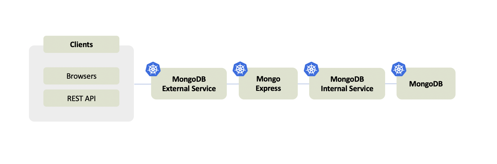

# Secret and ConfigMap
Kubernetes Cluster 내의 Configuration 정보들을 앞서 배운 Component 들을 활용하여 어떻게 관리할 수 있는지 공부해보자     
가장 이해하고 다뤄보기 쉬운 DB 환경을 설계 해볼것이다  



- MongoDB  
- Mongo Express  
- MongoDB 의 url 정보를 담고 있는 `ConfigMap`  
- MongoDB 의 credentials 정보를 담고 있는 `Secret`  
- K8S 내 외부로 DB 에 접근을 돕는 `Service` 들

현재 [mongo.yaml](../sources/mongo.yaml) 은 생성이 완료된 `Secret` 과 `ConfigMap` 을 참조하는 완성품(?) 이라고 볼 수 있지만  
`Secret` 과 `ConfigMap` 을 먼저 생성한 이후에 설정 파일이 이를 참조할 수 있고  
생성 이전에 임의의 참조값을 사용하게 된다면 에러가 발생할 것이니 무턱대고 [mongo.yaml](../sources/mongo.yaml) 를 복붙하는 일이 없도록 유의하자        


## Secret
[mongo-secret.yaml](../sources/mongo-secret.yaml) 에 MongoDB credentials 정보를 담는다  

| Values | Description |
|:---:|:---:|
| `kind` | 생성할 Component 에 대한 정보 |
| `type` | 임의의 key-value 타입의 `Secret` 인 `Opaque` 를 사용한다 |
| `data` | `Secret` 이 담을 credential 데이터 |

`Secret` 에 들어가는 `data` 역시 plaintext 가 아닌 Base64 로 인코딩한 후 저장한다  
터미널에 다음과 같은 명령어를 입력한 후 나오는 출력을 `data` 부분에 기입하자  
```shell script
# Command
echo -n 'username' | base64

# Console Output
dXNlcm5hbWU=
```

파일의 작성이 완료되었다면 다음 명령어로 `Secret` 을 생성해보자  
```shell script
# Command
kubectl apply -f mongo-secret.yaml
```

이후 get 명령어를 통해 생성된 `Secret` 을 조회할 수 있다  
```shell script
# Command
kubectl get secret

# Console Output
NAME                  TYPE                                  DATA   AGE
default-token-5fjv8   kubernetes.io/service-account-token   3      2d23h
mongodb-secret        Opaque                                2      50s
```

`Secret` 이 생성되었음을 확인했다면 [mongo.yaml](../sources/mongo.yaml) 에서 [mongo-secret.yaml](../sources/mongo-secret.yaml) 을 참조할 수 있도록 알맞는 key-value 값을 넣어주자  

| Values | Description |
|:---:|:---:|
| `env:name` | MongoDB 에서 필요로 하는 변수의 이름 |
| `secretRef:name` | `Secret` 파일의 이름 |
| `key` | `Secret` 파일 내 `data` 에 정의한 `key` 값 |


참조값을 올바르게 입력한 후 Deployment 를 생성해보자  
```shell script
# Command
kubectl apply -f mongo.yaml
```
이후 다음 명령어를 통해 여태 생성한 Component 들을 조회해보자  
```shell script
# Command
kubectl get all

# Console Output
NAME                                     READY   STATUS                       RESTARTS   AGE
pod/mongodb-deployment-ffb479dbc-bvd4m   0/1     CreateContainerConfigError   0          4m19s

NAME                 TYPE        CLUSTER-IP   EXTERNAL-IP   PORT(S)   AGE
service/kubernetes   ClusterIP   10.96.0.1    <none>        443/TCP   2d23h

NAME                                 READY   UP-TO-DATE   AVAILABLE   AGE
deployment.apps/mongodb-deployment   0/1     1            0           4m19s

NAME                                           DESIRED   CURRENT   READY   AGE
replicaset.apps/mongodb-deployment-ffb479dbc   1         1         0       4m19s
```


## Internal Service
다음은 MongoDB 에 종속되는 Service 를 구성할 것이다  
[mongo.yaml](../sources/mongo.yaml) 내부에 `---` 문자열로 문서를 구분해서 작성하면 `Deployment` 과 함께 `Service` 설정을 정의할 수 있다     

| Values | Description |
|:---:|:---:|
| `selector:app` | 연결할 `Pod` label |
| `port` | `Service` 에 열어둘 포트, MongoDB에 포워딩할 포트 |
| `targetPort` | 실제 서비스가 동작중인 포트, MongoDB 의 포트 |


설정을 추가한 mongo.yaml 을 다시 적용해보자  
```shell script
# Command
kubectl apply -f mongo.yaml

# Console Output
deployment.apps/mongodb-deployment unchanged
service/mongodb-service created
``` 

명시한 대로 mongodb-service 가 생성되었다  
관련 설정들이 정상적으로 적용이 되었는지 다음 명령어들을 통해 확인해보자  
```shell script
# Command
kubectl get service

# Console Output
NAME              TYPE        CLUSTER-IP     EXTERNAL-IP   PORT(S)     AGE
kubernetes        ClusterIP   10.96.0.1      <none>        443/TCP     3d2h
mongodb-service   ClusterIP   10.104.105.5   <none>        27017/TCP   55s

# Command
kubectl describe service mongodb-service

# Console Output
Name:              mongodb-service
Namespace:         default
Labels:            <none>
Annotations:       kubectl.kubernetes.io/last-applied-configuration:
                     {"apiVersion":"v1","kind":"Service","metadata":{"annotations":{},"name":"mongodb-service","namespace":"default"},"spec":{"ports":[{"port":...
Selector:          app=mongodb
Type:              ClusterIP
IP:                10.104.105.5
Port:              <unset>  27017/TCP
TargetPort:        27017/TCP
Endpoints:         {이 위치에 원래 URI:포트 정보가 보여야 함}
Session Affinity:  None
Events:            <none>
```
